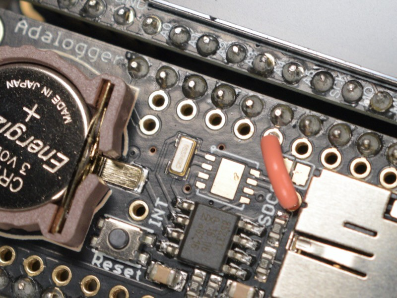

<!-- SPDX-License-Identifier: MIT -->
<!-- SPDX-FileCopyrightText: Copyright 2024 Sam Blenny -->
# Feather TFT Clock

**WORK IN PROGRESS (ALPHA)**

This clock uses USB gamepad input to set the time and date. The code shows how
to make a state machine to set a Real Time Clock chip with button input events
and a simulated seven segment display. The display uses sprites made in Krita.

[**TODO:** project photo]

[**TODO:** spritesheet]

## Hardware

### Parts

- 8BitDo SN30 Pro USB gamepad
  ([product page](https://www.8bitdo.com/sn30-pro-usb-gamepad/))

- Adafruit ESP32-S3 TFT Feather - 4MB Flash, 2MB PSRAM
  ([product page](https://www.adafruit.com/product/5483),
  [learn guide](https://learn.adafruit.com/adafruit-esp32-s3-tft-feather))

- Adafruit USB Host FeatherWing with MAX3421E
  ([product page](https://www.adafruit.com/product/5858),
  [learn guide](https://learn.adafruit.com/adafruit-usb-host-featherwing-with-max3421e))

- Adalogger FeatherWing - RTC + SD
  ([product page](https://www.adafruit.com/product/2922),
  [learn guide](https://learn.adafruit.com/adafruit-adalogger-featherwing))

- FeatherWing Tripler Mini Kit
  ([product page](https://www.adafruit.com/product/3417))

- CR1220 12mm Diameter - 3V Lithium Coin Cell Battery
  ([product page](https://www.adafruit.com/product/380))

- Tamiya Universal Plate Set #70157
  (3mm thick, 160x60mm ABS plates with 3mm holes on 5mm grid)

- M2.5 Nylon Standoff Set
  (misc. M2.5 machine screws, standoffs, and nuts)

### Tools and Consumables

- Soldering iron

- Solder

- Fine point hobby knife with safety handle (X-ACTO or similar)

- Solid-Core insulated 22AWG hookup wire (Adafruit
  [#289](https://www.adafruit.com/product/289) or similar)

- Wire strippers (Adafruit [#527](https://www.adafruit.com/product/527) or
  similar)

- Breadboard (Adafruit [#65](https://www.adafruit.com/product/65),
  [#239](https://www.adafruit.com/product/239),
  or similar)

- Soldering Vise (Adafruit [#3197](https://www.adafruit.com/product/3197) or
  similar)

- Flush diagonal cutters
  (Adafruit [#152](https://www.adafruit.com/product/152) or similar)

- Adhesive tape with clean-removable adhesive (Kapton tape, 3M Scotch 35
  electrical tape, blue painter's tape, or whatever)

### Pinouts

| TFT feather | USB Host | ST7789 TFT | Adalogger          |
| ----------- | -------- | ---------- | ------------------ |
|  SCK        |  SCK     |            | SCK (SD)           |
|  MOSI       |  MOSI    |            | MOSI (SD)          |
|  MISO       |  MISO    |            | MISO (SD)          |
|  SDA        |          |            | SDA (RTC)          |
|  SCL        |          |            | SCL (RTC)          |
|  D9         |  IRQ     |            |                    |
|  D10        |  CS      |            | (Not SDCS!)        |
|  D11        |          |            | SDCS (wire jumper) |
|  TFT_CS     |          |  CS        |                    |
|  TFT_DC     |          |  DC        |                    |

## Assemble the Hardware

If you are unfamiliar with soldering headers, you might want to read:

- [Adafruit Guide To Excellent Soldering](https://learn.adafruit.com/adafruit-guide-excellent-soldering/tools)

- [How To Solder Headers](https://learn.adafruit.com/how-to-solder-headers)

### Order of Soldering

1. The TFT Feather, USB Host Featherwing, and Adalogger FeatherWing each come
   with two strips of 16-position male header. Since feather boards have 16
   holes on one side and 12 holes on the other, use your flush cutters to trim
   4 pins off the header strips for the 12-hole sides.

2. Assemble the USB Host FeatherWing with pin headers on a breadboard, then
   solder the headers in place. (The breadboard will align your header pins at
   the right angle relative to the FeatherWing PCB. Once the FeatherWing pins
   are done, you can use the FeatherWing as a jig to help hold the Tripler's
   female headers while you solder them.)

3. Locate a set of female headers from your FeatherWing Tripler kit. Remove the
   USB host FeatherWing from the breadboard, then put female headers onto the
   pins of the USB host FeatherWing.

4. Using the USB host FeatherWing to hold the female headers in place, put the
   female header pins into one of the silkscreened Feather footprints of the
   Tripler. Tape the ends of the USB host FeatherWing to the Tripler, being
   careful not to cover any of the pins.

5. Clamp the Tripler in a vise and solder the female headers in place.

6. Locate another set of female headers from your Tripler kit. Remove the USB
   host FeatherWing from the Tripler, then put the female headers onto the pins
   of the USB host board.

7. Put the female header pins into one of the open silkscreen footprint of your
   Tripler board, then prepare the assembly as before with tape and a vise.

8. Solder the female header pins in place.

9. Repeat the previous 6 steps to solder the third set of female headers in
   place on the third silkscreen footprint of your Tripler.

10. Carefully assemble your ESP32-S3 TFT Feather with header pins on a
    breadboard. Leave the protective film in place to protect the display from
    flux splatter. Solder the header pins in place. You can use the solder wire
    to bend the pull tab of the protective film out of the way so it does not
    touch your soldering iron.

11. Remove the Feather TFT from the breadboard and set it aside.

12. Assemble the Adalogger FeatherWing with pin headers on a breadboard, then
    solder the headers in place.

13. **IMPORTANT:** The Adalogger FeatherWing's default SD card CS pin is D10,
    which conflicts with the CS pin for the USB Host FeatherWing, so the
    Adalogger's SDCS signal needs to be moved with a wire jumper. For more
    details, check out the
    [SD & SPI Pins](https://learn.adafruit.com/adafruit-adalogger-featherwing?view=all#sd-and-spi-pins-2933321)
    section of the Adalogger Learn Guide.

    Locate the Adalogger's SDCS silkscreen label next to the corner of its
    micro SD card slot. Right next to the "CS" of the SDCS label, you should
    see a jumper (two rectangular pads joined by a thin trace) along with a
    round drilled pad. Use a fine point hobby knife to cut the trace between
    the jumper pads with a light scraping motion.

14. Cut and strip a piece of 22AWG insulated hookup wire long enough to reach
    from the SDCS drilled pad over to the inner pad for the Adalogger's D11 pin
    (one pad closer to the battery holder).

15. Clamp the Adalogger board in a vise, solder the jumper wire from the
    bottom of the board, then trim the excess wire ends with flush cutters. The
    end result should look like this:

    

### Smoke Test and Final Assembly

1. (optional) Use nylon M2.5 standoffs to mount your Tripler board on a
   backplate, such as a Tamiya Universal Plate, so the board is easier to
   handle without shorts or static discharges.

2. Assemble the Tripler with your Feather TFT, USB Host FeatherWing, and
   Adalogger FeatherWing.

3. Try plugging your board into a USB charger to make sure the LEDs light up.

4. If the LEDs light up, unplug the USB power cable, install the CR1220 coin
   cell in your Adalogger's battery holder, then plug the USB gamepad into the
   Host FeatherWing's USB A port.

## Updating CircuitPython

**NOTE: To update CircuitPython on the ESP32-S3 TFT Feather with 2MB PSRAM and
4MB Flash, you need to use the .BIN file (combination bootloader and
CircuitPython core)**

1. Download the CircuitPython 9.1.3 **.BIN** file from the
   [Feather ESP32-S3 TFT PSRAM](https://circuitpython.org/board/adafruit_feather_esp32s3_tft/)
   page on circuitpython.org

2. Follow the instructions in the
   [Web Serial ESPTool](https://learn.adafruit.com/circuitpython-with-esp32-quick-start/web-serial-esptool)
   section of the "CircuitPython on ESP32 Quick Start" learn guide to update
   your board with CircuitPython 9.1.3. First erasing the board's contents,
   then programming it with the .BIN file.

   If you encounter errors with the Adafruit ESPTool web application, you can
   also try Espressif's [ESP32 Tool](https://espressif.github.io/esptool-js/)
   web application. But, if you do that, be sure to se the "Flash Address"
   field to "0" before using the "Program" button.

## Installing CircuitPython Code

To copy the project bundle files to your CIRCUITPY drive:

1. Download the project bundle .zip file using the button on the Playground
   guide or the attachment download link on the GitHub repo Releases page.

2. Expand the zip file by opening it, or use `unzip` in a Terminal. The zip
   archive should expand to a folder. When you open the folder, it should
   contain a `README.txt` file and a `CircuitPython 9.x` folder.

3. Open the CircuitPython 9.x folder and copy all of its contents to your
   CIRCUITPY drive.

To learn more about copying libraries to your CIRCUITPY drive, check out the
[CircuitPython Libraries](https://learn.adafruit.com/welcome-to-circuitpython/circuitpython-libraries)
section of the
[Welcome to CircuitPython!](https://learn.adafruit.com/welcome-to-circuitpython)
learn guide.

## Running the Code

1. Connect the USB gamepad to the MAX3421E USB Host Featherwing before applying
   power to the Feather TFT. (USB hot plugging may be unreliable)

2. Plug a computer or charger into the Feather TFT ESP32-S3 USB C port.

<!-- =============================================================== -->
<!-- =============================================================== -->
[**TODO:** Finish this]
<!-- =============================================================== -->
<!-- =============================================================== -->

